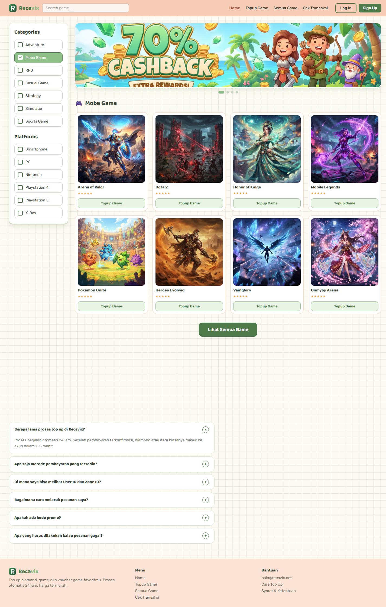
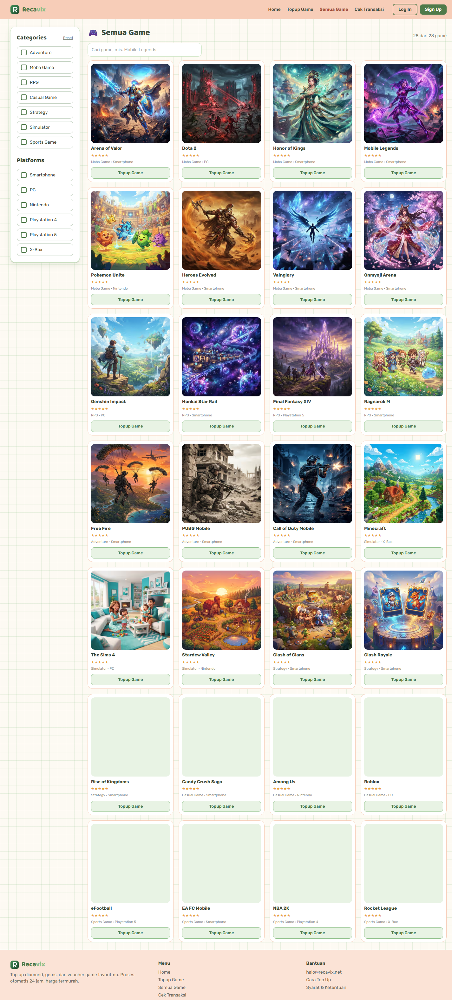
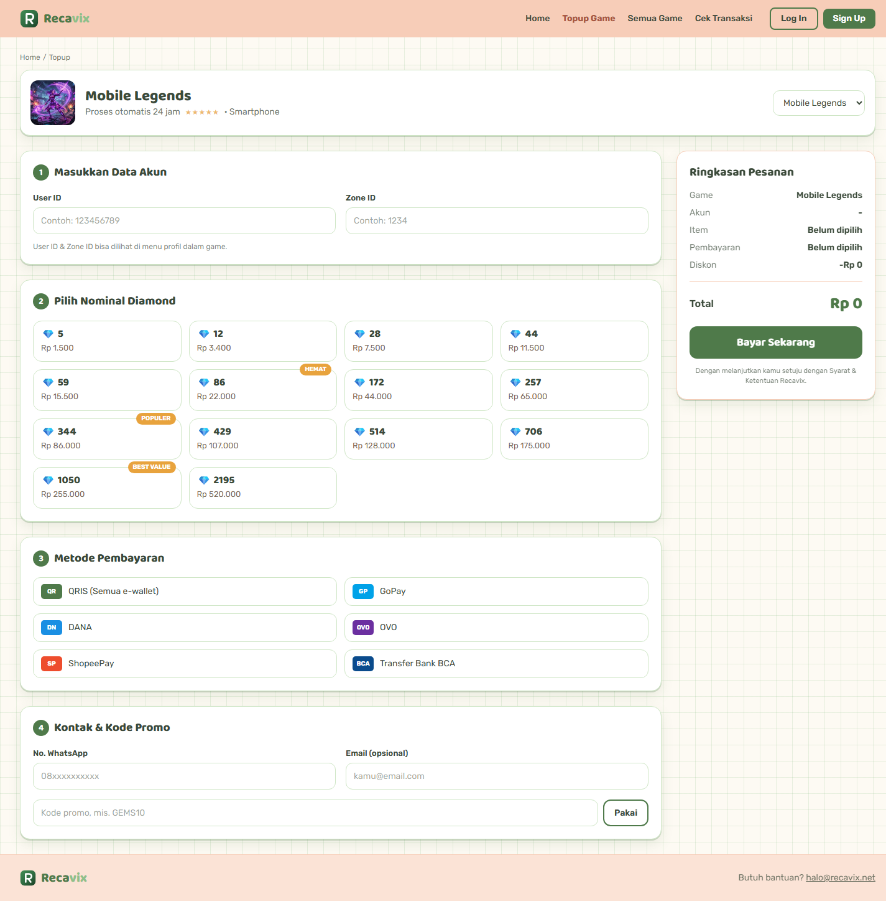
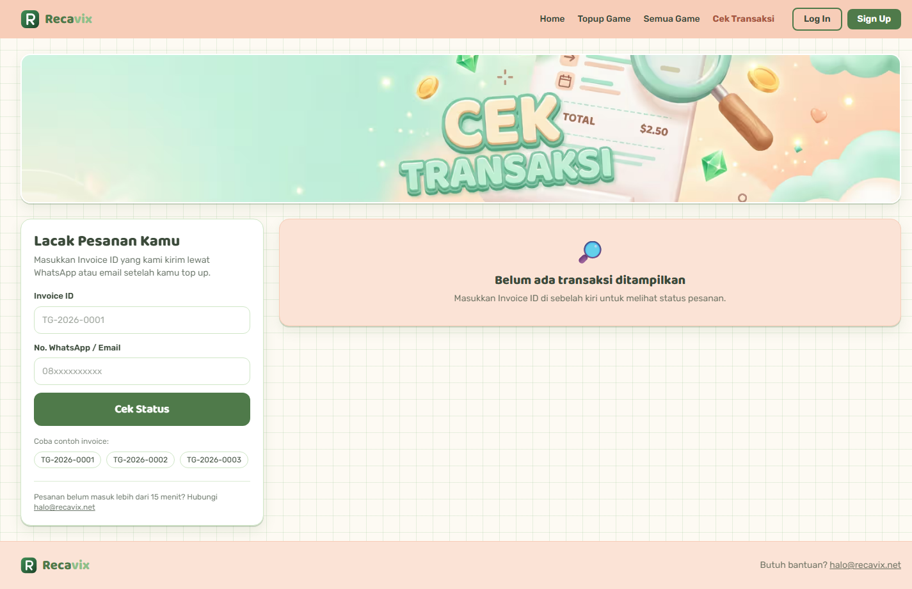
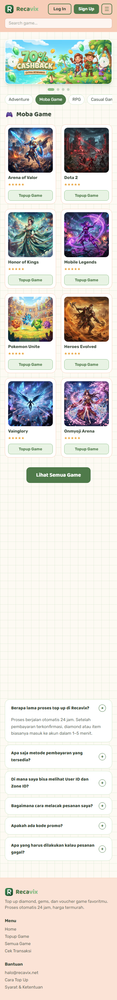
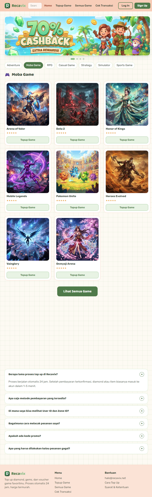
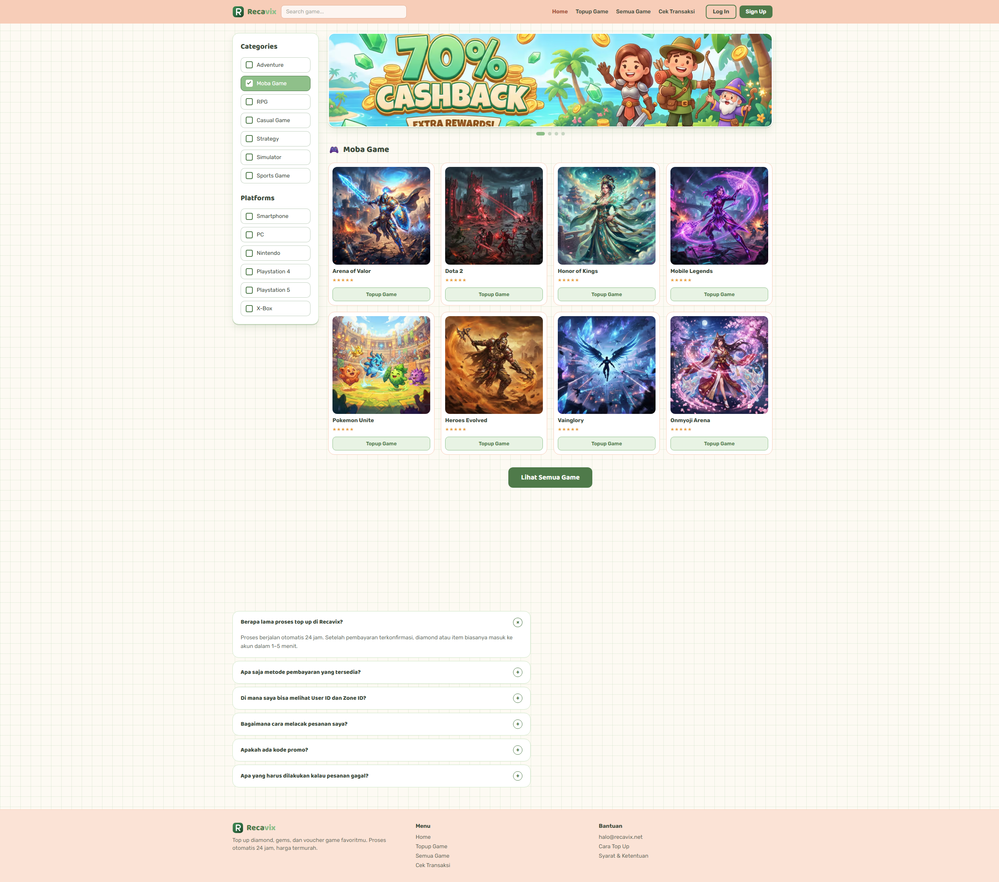

# Recavix 🎮

**Top up diamond, gems & voucher game — harga termurah, proses otomatis 24 jam.**

Platform top-up game untuk pasar Indonesia. Katalog 28 game populer, alur checkout 4 langkah,
kalkulator promo, dan pelacak status transaksi — semuanya dibangun sebagai web app modern
dengan Next.js App Router, animasi halus, dan SEO teknis yang lengkap.

[](https://nextjs.org)
[](https://react.dev)
[](https://www.typescriptlang.org)
[](https://tailwindcss.com)
[](https://motion.dev)
[](https://eslint.org)



---

## ✨ Fitur

- **Katalog 28 game** — Mobile Legends, Genshin Impact, PUBG Mobile, Free Fire, Dota 2,
  Honkai Star Rail, dan lainnya; terbagi dalam **7 kategori** dan **6 platform**.
- **Pencarian & filter real-time** — cari berdasarkan nama, saring dengan kombinasi
  kategori + platform secara bersamaan, lengkap dengan hitungan hasil dan empty state.
- **Carousel promo otomatis** — 4 slide banner yang berganti tiap 3,5 detik, berhenti
  saat di-hover/focus, bisa dikontrol manual lewat tombol prev/next dan dot.
- **Alur checkout 4 langkah** — isi data akun (User ID + Zone ID) → pilih nominal →
  pilih metode pembayaran → kontak & kode promo, dengan ringkasan pesanan *sticky*.
- **Harga per game** — tiap game punya daftar paket diamond sendiri (nominal, harga, badge),
  jadi Mobile Legends dan Dota 2 bisa punya harga yang berbeda.
- **6 metode pembayaran** — QRIS, GoPay, DANA, OVO, ShopeePay, dan Transfer Bank BCA.
- **Kode promo berfungsi** — `GEMS10` (diskon 10%) dan `NEWBIE5` (diskon 5%). Daftarnya diatur
  dari dashboard, dan **server selalu menghitung ulang diskonnya** saat pesanan dibuat sehingga
  angka di browser tidak bisa dimanipulasi.
- **Pelacak transaksi** — masukkan Invoice ID **+ User ID** untuk melihat status
  (menunggu / sedang diproses / selesai / dibatalkan), rincian pesanan, dan timeline
  riwayat status.
- **Halaman pembayaran per pesanan** — `/pembayaran/<invoice>` menampilkan gambar QRIS atau
  nomor tujuan beserta tombol salin, hitung mundur 15 menit, tombol **Saya Sudah Bayar**,
  dan tombol konfirmasi WhatsApp yang sudah terisi nomor invoice serta totalnya.
- **Dashboard admin** — `/admin` untuk mengelola pesanan, katalog, paket diamond, metode
  pembayaran, banner hero, ulasan, FAQ, kode promo, dan identitas brand. **Fail-closed**:
  tanpa `ADMIN_PASSWORD`, seluruh dashboard menolak akses.
- **SEO teknis lengkap** — metadata per halaman, canonical, Open Graph, Twitter Card,
  6 tipe JSON-LD, `sitemap.xml`, `robots.txt`, dan URL bersih.
- **Fully responsive** — diuji dari mobile 390px sampai ultra-wide 2560px.
- **Aksesibilitas** — landmark semantik, satu `<h1>` per halaman, skip-link, `aria-label`,
  `aria-live` untuk hasil pencarian transaksi, dan menghormati `prefers-reduced-motion`.

---

## 🧱 Tech Stack

| Lapisan | Teknologi |
| --- | --- |
| Framework | Next.js **15.5** (App Router, React Server Components) |
| UI | React **19**, Framer Motion **13** |
| Bahasa | TypeScript **5.7** (`strict: true`, alias `@/*`) |
| Styling | Tailwind CSS **4** — design token via `@theme` di `app/globals.css`, tanpa `tailwind.config.js` |
| Font | `next/font/local` — self-hosted **Rubik** (400–700) & **Baloo 2** (600–800), zero layout shift |
| SEO | Metadata API + JSON-LD (`schema.org`) |
| Linting | ESLint **9** + `eslint-config-next` |
| Image | `next/image` dengan format AVIF & WebP |

---

## 🗺️ Halaman

| Route | Deskripsi |
| --- | --- |
| `/` | Beranda — carousel promo, filter kategori/platform, grid game, testimoni, FAQ. JSON-LD `FAQPage`. |
| `/topup` | Checkout — alur 4 langkah dengan ringkasan pesanan sticky. JSON-LD `Product` + `BreadcrumbList`. |
| `/games` | Katalog lengkap — pencarian teks + sidebar filter. Server component yang membaca `?q=` dari `searchParams`. JSON-LD `ItemList` + `BreadcrumbList`. |
| `/pembayaran/[invoice]` | Halaman pembayaran satu pesanan — instruksi bayar, hitung mundur 15 menit, tombol “Saya Sudah Bayar”. `noindex`. |
| `/cek-transaksi` | Pelacak status pesanan berdasarkan Invoice ID **+ User ID**. JSON-LD `BreadcrumbList`. |
| `/admin` | **Dashboard admin** — ringkasan, pesanan, katalog game, paket diamond, metode pembayaran, banner hero, ulasan & FAQ, promo, identitas & navigasi. Butuh login, `noindex`. |
| `/admin/login` | Form masuk admin. Sesi disimpan di cookie `httpOnly` bertanda tangan HMAC-SHA256. `noindex`. |
| `*` | Halaman 404 kustom dengan CTA kembali ke beranda / katalog. |

**Mencoba alur pesanan:** buat pesanan lewat `/topup` — kamu akan diarahkan ke
`/pembayaran/<invoice>`. Invoice dan User ID yang dipakai bisa langsung dites di
`/cek-transaksi`. Kode promo contoh: `GEMS10`, `NEWBIE5`.

---

## 📁 Struktur Project

```
recavix/
├─ app/                        # App Router
│  ├─ page.tsx                 #   /
│  ├─ topup/page.tsx           #   /topup
│  ├─ games/page.tsx           #   /games (async — baca ?q= dari searchParams)
│  ├─ cek-transaksi/page.tsx   #   /cek-transaksi
│  ├─ pembayaran/[invoice]/    #   /pembayaran/[invoice] — instruksi bayar (noindex)
│  ├─ admin/                   #   /admin — login + (dashboard) 9 halaman pengelolaan
│  ├─ layout.tsx               #   metadata global + JSON-LD Organization & WebSite
│  ├─ not-found.tsx            #   404
│  ├─ robots.ts                #   robots.txt
│  ├─ sitemap.ts               #   sitemap.xml
│  └─ globals.css              #   design token Tailwind v4 (@theme)
├─ components/
│  ├─ layout/                  #   Header, HeaderBar, Footer, Container, Breadcrumbs, SiteShell
│  ├─ home/                    #   HomeExplorer, HeroCarousel, FaqAccordion, Testimonials
│  ├─ games/                   #   GamesExplorer — pencarian + filter
│  ├─ topup/                   #   TopupFlow + StepCard, DiamondPackGrid, PaymentMethodGrid, OrderSummary
│  ├─ order/                   #   PaymentInstructions, PaymentCountdown, MarkPaidButton, CopyButton
│  ├─ transactions/            #   TransactionDetail, StatusTimeline, TransactionNotFound
│  ├─ admin/                   #   form primitives, editor game/paket/pembayaran, upload gambar
│  ├─ seo/                     #   JsonLd
│  └─ ui/                      #   GameCard, SectionCard, Reveal, StarRating, FilterRow, Icon, ...
├─ data/                       # Nilai bawaan (seed) — dipakai selama tabel masih kosong
├─ lib/                        # cn, collections, cache, format, media, fonts, seo, pricing,
│                              #   supabase/ catalog/ payments/ orders/ content/ admin/
├─ types/                      # Tipe domain
├─ public/                     # fonts/, icons/, images/
└─ preview/                    # Screenshot dokumentasi
```

---

## 🚀 Menjalankan

```bash
# 1. Install dependency
npm install

# 2. Jalankan dev server
npm run dev
# → http://localhost:3000
```

Perintah lain:

```bash
npm run build      # build produksi
npm run start      # jalankan hasil build
npm run lint       # ESLint
npm run typecheck  # TypeScript tanpa emit
```

### Konfigurasi

| Variabel | Wajib | Fungsi |
| --- | --- | --- |
| `NEXT_PUBLIC_SITE_URL` | tidak | Basis URL absolut untuk canonical, Open Graph, sitemap, dan JSON-LD. Default `https://recavix.net`. |
| `SUPABASE_URL` | untuk produksi | URL project Supabase. Dipakai server-side untuk baca/tulis katalog. |
| `SUPABASE_SECRET_KEY` | untuk produksi | Secret key Supabase (`sb_secret_…`). **Server-side saja.** |
| `ADMIN_PASSWORD` | ya | Mengaktifkan login `/admin`. Selama kosong, dashboard **menolak akses**. |
| `ADMIN_SESSION_SECRET` | tidak | Kalau kosong, diturunkan dari `ADMIN_PASSWORD`. Isi kalau ingin membatalkan sesi lama tanpa mengganti password. |
| `NEXT_PUBLIC_CLOUDINARY_CLOUD_NAME` | tidak | Cloudinary untuk upload gambar. |
| `NEXT_PUBLIC_CLOUDINARY_UPLOAD_PRESET` | tidak | Preset upload **unsigned**. Tanpa API secret. |

Kalau `SUPABASE_URL` / `SUPABASE_SECRET_KEY` kosong, katalog jatuh ke isi bawaan di `data/`
(read-only) — cukup untuk menjalankan `npm run dev` tanpa menyentuh data produksi.
Lihat `.env.example` untuk daftar lengkapnya.

> **Catatan penting:** pastikan `NODE_ENV` **tidak** di-set ke `production` secara global di
> shell kamu. `next dev` wajib berjalan di mode `development` — kalau tidak, semua halaman
> akan mengembalikan `500 Internal Server Error`.

## 🛠️ Dashboard Admin

Ada di `/admin`. Yang bisa dikelola pada versi ini:

| Halaman | Isi |
| --- | --- |
| **Ringkasan** | Nilai pesanan masuk, antrian verifikasi, game aktif, paket diamond, metode bayar, daftar harga paket, game tersembunyi, dan tombol kembalikan ke isi awal. |
| **Pesanan** | Filter per status, detail tiap pesanan, dan pengubahan status. |
| **Katalog** | 28 game — tambah, sembunyikan tanpa menghapus, buka editor per game (nama, slug, kategori, platform, rating, ikon). |
| **Paket Diamond** | Pilih game dulu, lalu atur nominal, harga, badge, urutan, dan aktif/nonaktif paket game itu. Harga tiap game berdiri sendiri. |
| **Pembayaran** | Nama, warna/kode chip, tipe (QRIS atau transfer), nomor tujuan, gambar QR, logo, instruksi, dan aktif/nonaktif. |
| **Banner Hero** | Slide carousel beranda — gambar, alt text, link tujuan, dan urutan. |
| **Ulasan & FAQ** | Ulasan pelanggan di beranda, dan pertanyaan umum (accordion + JSON-LD `FAQPage`). |
| **Promo** | Kode promo dan besar diskonnya. |
| **Identitas & Navigasi** | Nama brand, tagline, deskripsi, kontak CS, media sosial, menu header, dan menu bantuan footer. |

Cara kerjanya:

- **Login** memakai cookie `httpOnly` bertanda tangan HMAC-SHA256, dibandingkan dengan
  `timingSafeEqual`. Tidak ada dependency auth eksternal.
- **Fail-closed.** Tanpa `ADMIN_PASSWORD`, seluruh `/admin` menolak akses — bukan terbuka
  untuk umum. Lebih baik terkunci karena salah konfigurasi daripada bisa diubah siapa saja.
- **Setiap server action memeriksa sesi sendiri**, bukan hanya layout. Jadi menembak action-nya
  langsung tanpa login tetap ditolak.
- **Hanya yang aktif yang sampai ke pembeli.** Game dan paket nonaktif tetap tersimpan lengkap
  di dashboard, tapi hilang dari beranda, katalog, dan halaman top up.
- **Metode pembayaran yang aktif tapi datanya belum lengkap otomatis dinonaktifkan saat
  disimpan**, dan dashboard memberi tahu metode mana yang kena.
- **Tiap bagian identitas punya action sendiri yang menggabung, bukan mengganti.** Form kontak
  hanya mengirim field kontak; kalau action-nya mengganti seluruh objek settings, nama brand
  dan media sosial akan ikut terhapus.
- **Nama brand yang diubah di dashboard ikut ke mana-mana** — logo, judul tab, metadata SEO,
  dan JSON-LD — karena semua halaman memakai `generateMetadata`, bukan metadata statis.
- Setiap simpan menembak `revalidateTag`, jadi halaman publik ikut segar sementara halaman
  yang di-prerender tetap statis.
- Upload gambar dikirim langsung dari browser ke **Cloudinary** (preset unsigned), jadi file
  tidak lewat server. Dibatasi PNG/JPG/WebP dan maksimal 2 MB.

## 🧾 Alur Pesanan

1. Pembeli memilih game, nominal, dan metode di `/topup`, lalu menekan **Bayar Sekarang**.
2. Server memvalidasi pilihannya, **mencari harga paket di database**, menghitung diskon dan
   total, lalu menyimpan baris di tabel `orders` dengan nomor invoice `RCV-YYMMDD-XXXX`.
3. Pembeli diarahkan ke `/pembayaran/<invoice>`: instruksi bayar (gambar QRIS atau nomor
   rekening dengan tombol salin), hitung mundur 15 menit dari `created_at`, dan tautan
   konfirmasi WhatsApp.
4. Setelah transfer, pembeli menekan **Saya Sudah Bayar** → status `menunggu → dibayar`.
   Itu klaim, bukan verifikasi.
5. Admin mencocokkan mutasi di tab **Pesanan**, lalu mengubah statusnya ke `selesai` atau
   `batal`. Kartu **“Perlu diverifikasi”** di dashboard adalah antrian kerjanya.

| Status | Arti |
| --- | --- |
| `menunggu` | Pesanan dibuat, menunggu pembayaran |
| `dibayar` | Pembeli bilang sudah bayar — perlu dicek ke mutasi |
| `selesai` | Sudah diverifikasi dan dikirim |
| `batal` | Dibatalkan atau kedaluwarsa |

Status ditulis dari sudut pandang masing-masing: `dibayar` tampil sebagai **“Sedang Diproses”**
untuk pembeli, dan **“Sudah dibayar”** di dashboard admin.

Pelacak `/cek-transaksi` meminta **Invoice ID dan User ID**. Invoice saja tidak cukup karena
formatnya berurutan dan mudah ditebak, jadi User ID dipakai sebagai faktor kedua sebelum detail
pesanan ditampilkan.

## 🧠 Catatan Arsitektur

Katalog game dan metode pembayaran kini datang dari **Supabase** (Postgres lewat PostgREST),
dan diubah lewat **dashboard admin** di `/admin`. Semua konten presentasi ikut pindah ke sana.

- Katalog (`games`, `diamond_packs`) dan metode pembayaran disimpan sebagai baris di Postgres.
  Paket diamond di-key `(game_slug, id)`, jadi daftar harga tiap game berdiri sendiri; game yang
  belum diatur admin memakai isi bawaan.
  Halaman publik membacanya lewat `unstable_cache` bertag, lalu di-invalidasi dengan
  `revalidateTag` setiap admin menyimpan — jadi halaman tetap bisa di-prerender.
- Konten presentasi (identitas brand, kontak, media sosial, menu, slide banner, FAQ, ulasan,
  kode promo) disimpan sebagai **satu dokumen JSON** di tabel `site_content`, dengan `id = 'main'`.
  Tidak ada yang perlu meng-query "semua ulasan where…", jadi tidak perlu tabel sendiri.
- **`data/` sekarang hanya berisi nilai bawaan.** Dipakai selama tabelnya masih kosong, dan
  menjadi target tombol "kembalikan ke isi awal". Nilainya tetap ditulis sebagai modul
  TypeScript di `data/` supaya type-checked.
- **Origin dan locale tidak ikut disimpan.** `url`, `locale`, dan `lang` selalu berasal dari
  `data/site.ts`/env; `writeContent()` hanya menyimpan field yang memang urusan admin, supaya
  tidak ada nilai basi yang menyesatkan di database.
- Dokumen yang tersimpan **dilengkapi nilai bawaan per bagian**, bukan hanya per dokumen —
  jadi dokumen yang tersimpan sebelum sebuah bagian ada tetap aman dibaca.
- Semua permukaan interaktif (`Header`, `HeroCarousel`, `GamesExplorer`, `TopupFlow`,
  `MarkPaidButton`, dst.) adalah komponen `"use client"` yang dikendalikan `useState`.
- Server component yang membaca data: `app/page.tsx`, `app/games/page.tsx`, `app/topup/page.tsx`,
  `app/pembayaran/[invoice]/page.tsx`, `app/cek-transaksi/page.tsx`, dan seluruh `/admin`.
- **Pesanan tersimpan sungguhan** di tabel `orders`. Pembeli diarahkan ke
  `/pembayaran/<invoice>`, dan statusnya bisa dilacak di `/cek-transaksi`.
- **Harga tidak pernah dikirim dari browser.** Klien hanya mengirim slug game, id paket, dan
  id metode; server mencari harga aslinya di daftar paket **milik game itu** lalu menghitung
  diskon dan totalnya. Paket dengan id sama di game berbeda tidak bisa saling ditukar.
- **Verifikasi pembayaran masih manual.** Belum ada payment gateway — pembeli menandai
  “Saya Sudah Bayar”, lalu admin mencocokkan mutasi dan mengubah statusnya.

---

## 🗄️ Skema Database

Semua data hidup di **Supabase Postgres** dan diakses lewat PostgREST (`/rest/v1/…`).
Repo ini **tidak memuat file migrasi** — tabelnya dibuat manual di SQL Editor. Kolom di bawah
adalah yang **diharapkan kode**: nama kolom memakai gaya `snake_case` Postgres, lalu dipetakan
ke camelCase di `lib/*/store.ts`.

**`games`** — primary key `slug`

| Kolom | Tipe | Catatan |
| --- | --- | --- |
| `slug` | text | **Primary key** |
| `name` | text | |
| `category` | text | Salah satu dari 7 kategori di `types/index.ts` |
| `platform` | text | Salah satu dari 6 platform |
| `image` | text | Path di `public/`, contoh `/images/games/mobile-legends.png` |
| `rating` | numeric | 1–5 |
| `is_active` | boolean | `false` = disembunyikan dari situs, datanya tetap tersimpan |
| `sort_order` | integer | Urutan tampil |
| `updated_at` | timestamptz | |

**`diamond_packs`** — primary key gabungan (`game_slug`, `id`)

Harga diatur **per game**: satu game punya satu daftar paket sendiri. Selama sebuah game belum
punya baris di tabel ini, game itu memakai nominal dan harga bawaan dari
`data/diamond-packs.ts` — jadi tabelnya boleh dibiarkan kosong.

Kalau tabel `diamond_packs` sudah ada dari versi sebelumnya, ubah sekali di SQL Editor:

```sql
alter table public.diamond_packs add column if not exists game_slug text;
alter table public.diamond_packs alter column game_slug set not null;
alter table public.diamond_packs drop constraint if exists diamond_packs_pkey;
alter table public.diamond_packs add constraint diamond_packs_pkey primary key (game_slug, id);
```

Baris `set not null` hanya berhasil kalau tabelnya kosong. Kalau sudah ada baris lama, isi dulu
`game_slug`-nya atau hapus barisnya sebelum menjalankan baris berikutnya.

| Kolom | Tipe | Catatan |
| --- | --- | --- |
| `game_slug` | text | **Bagian dari primary key.** Slug game pemilik paket |
| `id` | text | **Bagian dari primary key.** Contoh `pack-86`; cukup unik di dalam satu game |
| `diamonds` | integer | Jumlah nominal |
| `price` | integer | Rupiah, angka penuh tanpa titik |
| `tag` | text | Nullable. Badge seperti `HEMAT` / `POPULER` |
| `is_active` | boolean | Paket nonaktif tidak muncul di checkout |
| `sort_order` | integer | |
| `updated_at` | timestamptz | |

**`payment_methods`** — primary key `id`

| Kolom | Tipe | Catatan |
| --- | --- | --- |
| `id` | text | **Primary key** |
| `name` | text | |
| `color`, `code` | text | Warna dan kode chip ikon |
| `type` | text | `qris` atau `transfer` |
| `account_label`, `account_number`, `account_name` | text | Nullable. Untuk tipe `transfer` |
| `qr_image`, `logo` | text | Nullable. URL gambar hasil upload |
| `instructions` | jsonb atau text[] | Langkah cara bayar |
| `is_active` | boolean | Metode aktif tapi datanya kosong otomatis dinonaktifkan saat disimpan |
| `sort_order` | integer | |
| `updated_at` | timestamptz | |

**`orders`** — primary key `id`

| Kolom | Tipe | Catatan |
| --- | --- | --- |
| `id` | uuid | **Primary key**, `default gen_random_uuid()` |
| `invoice` | text | **Wajib `unique`** — lihat catatan di bawah |
| `game_slug` | text | Nullable |
| `game_name`, `item_label` | text | Snapshot nama saat pesanan dibuat |
| `diamonds` | integer | Nullable |
| `account_id`, `zone_id`, `contact` | text | `zone_id` dan `contact` nullable |
| `payment_method`, `payment_method_id` | text | Snapshot nama metode + id aslinya |
| `subtotal`, `fee`, `discount`, `total` | integer | Rupiah. `fee` masih selalu `0` |
| `promo_code` | text | Nullable |
| `status` | text | `menunggu` / `dibayar` / `selesai` / `batal` |
| `created_at` | timestamptz | `default now()` |
| `updated_at` | timestamptz | |

**`site_content`** — primary key `id`

| Kolom | Tipe | Catatan |
| --- | --- | --- |
| `id` | text | **Primary key**, diisi tetap `main` |
| `data` | jsonb | Identitas brand, kontak, sosial, menu, banner, FAQ, ulasan, promo |
| `updated_at` | timestamptz | |

Catatan yang mudah bikin bingung:

- **Primary key itu wajib, bukan opsional.** Menyimpan dari dashboard memakai upsert PostgREST
  (`Prefer: resolution=merge-duplicates`), dan upsert butuh primary key sebagai penentu konflik.
- **`orders.invoice` harus `unique`.** Constraint itulah penjaga terakhir ketika nomor invoice
  bentrok: kode menangkap `409` lalu mencoba nomor lain, sampai 5 kali.
- **Tabel kosong bukan error.** Katalog, metode pembayaran, dan konten jatuh ke isi bawaan di
  `data/`, jadi `npm run dev` tetap jalan sebelum database diisi.
- **`SUPABASE_SECRET_KEY` dipakai server-side saja.** Secret key melewati RLS, jadi tabel boleh
  dikunci rapat untuk anon — dashboard tetap bisa baca/tulis.
- **`data` di `site_content` tidak menyimpan `url`, `locale`, dan `lang`.** Ketiganya selalu
  berasal dari `data/site.ts`/env supaya tidak ada origin basi yang ikut tersimpan.

---

## 🔍 SEO

- `createMetadata()` di `lib/seo.ts` menyusun `title`, `description`, `canonical`,
  Open Graph, dan Twitter Card secara konsisten untuk setiap halaman.
- JSON-LD terkirim di HTML awal lewat `components/seo/JsonLd.tsx`:
  **Organization**, **WebSite** (+ SearchAction), **FAQPage**, **ItemList** (katalog `VideoGame`),
  **Product** (dengan `AggregateOffer` IDR), dan **BreadcrumbList**.
- `app/robots.ts` dan `app/sitemap.ts` men-generate `robots.txt` serta `sitemap.xml`
  dengan prioritas dan `changeFrequency` per halaman.

---

## 📸 Galeri

**Desktop**

| Beranda | Katalog Game |
| --- | --- |
|  |  |

| Checkout Top Up | Cek Transaksi |
| --- | --- |
|  |  |

**Responsive** — mobile 390px · tablet 820px · ultra-wide 2560px

| Mobile | Tablet | Ultra-wide |
| --- | --- | --- |
|  |  |  |

---

## 🗺️ Roadmap

- [x] Backend order & lookup transaksi sungguhan, menggantikan dataset demo.
- [x] Dashboard admin untuk katalog, pembayaran, pesanan, dan seluruh konten presentasi.
- [ ] Integrasi payment gateway supaya pembayaran terverifikasi otomatis, bukan dicek manual admin.
- [ ] Autentikasi pengguna. Tombol **Log In / Sign Up sudah dihapus** karena hanya placeholder
      yang mengarah ke `#`; pembeli melacak pesanannya lewat Invoice ID + User ID di `/cek-transaksi`.
- [ ] Riwayat pesanan per akun.
- [ ] Notifikasi pesanan baru untuk admin (email / WhatsApp).
- [ ] Test otomatis (unit + E2E).

---

## 👤 Author

**ersetdigital-sudo**

- GitHub: [@ersetdigital-sudo](https://github.com/ersetdigital-sudo)
- Repository: [github.com/ersetdigital-sudo/recavix](https://github.com/ersetdigital-sudo/recavix)

---

## 📄 Lisensi

Belum ada lisensi eksplisit untuk project ini. Semua hak dilindungi pemiliknya —
hubungi author jika ingin menggunakannya.
